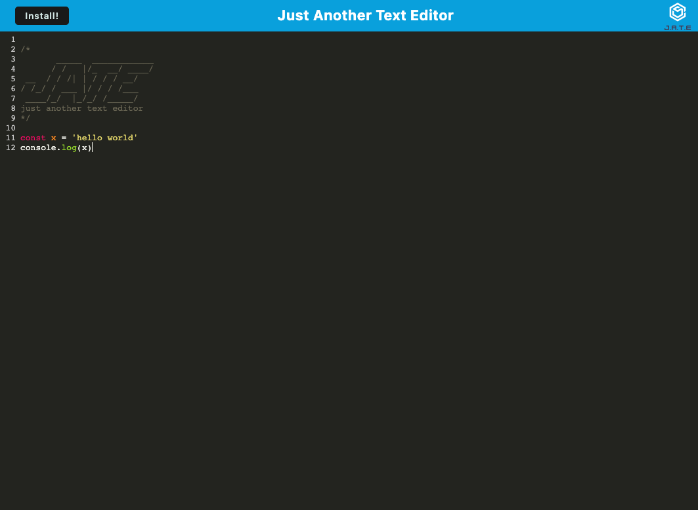

<div align="center">
  <h3 align="center">Text Editor</h3>

  <p align="center">
    A text editor that runs in the browser
    <br />
    The app will be a single-page application that meets the PWA criteria. Additionally, it will feature a number of data persistence techniques that serve as redundancy in case one of the options is not supported by the browser. The application will also function offline.
    <br />
    <a href="https://github.com/heranYang93/Text-Editor/demo/result.png">View User Routers Demo</a>
    ·
    <a href="https://github.com/heranyang93/Text-Editor/issues">Report Bug</a>
    ·
    <a href="https://github.com/heranyang93/Text-Editor/issues">Request Feature</a>
  </p>
</div>

<details>
  <summary>Table of Contents</summary>
  <ol>
    <li>
      <a href="#about-the-project">About The Project</a>
      <ul>
        <li><a href="#user-story">User Story</a></li>
        <li><a href="#acceptance-criteria">Acceptance Criteria</a></li>
        <li><a href="#built-with">Built With</a></li>
      </ul>
    </li>
    <li>
      <a href="#getting-started">Getting Started</a>
      <ul>
        <li><a href="#prerequisites">Prerequisites</a></li>
        <li><a href="#installation">Installation</a></li>
      </ul>
    </li>
    <li><a href="#usage">Usage</a></li>
    <li><a href="#contact">Contact</a></li>
  </ol>
</details>

## About The Project



MongoDB is a popular choice for many social networks due to its speed with large amounts of data and flexibility with unstructured data. This project is to build an API for a social network web application where users can share their thoughts, react to friends’ thoughts, and create a friend list. I have used Express.js for routing, a MongoDB database, and the Mongoose ODM. In addition to using the [Express.js](https://www.npmjs.com/package/express) and [Mongoose](https://www.npmjs.com/package/mongoose) packages, I have also used a JavaScript to format timestamps.

<p align="right">(<a href="#top">back to top</a>)</p>

### User Story

```md
AS A developer
I WANT to create notes or code snippets with or without an internet connection
SO THAT I can reliably retrieve them for later use
```

<p align="right">(<a href="#top">back to top</a>)</p>

### Acceptance Criteria

```md
GIVEN a text editor web application

WHEN I open my application in my editor
THEN I should see a client server folder structure

WHEN I run `npm run start` from the root directory
THEN I find that my application should start up the backend and serve the client

WHEN I run the text editor application from my terminal
THEN I find that my JavaScript files have been bundled using webpack

WHEN I run my webpack plugins
THEN I find that I have a generated HTML file, service worker, and a manifest file

WHEN I use next-gen JavaScript in my application
THEN I find that the text editor still functions in the browser without errors

WHEN I open the text editor
THEN I find that IndexedDB has immediately created a database storage

WHEN I enter content and subsequently click off of the DOM window
THEN I find that the content in the text editor has been saved with IndexedDB

WHEN I reopen the text editor after closing it
THEN I find that the content in the text editor has been retrieved from our IndexedDB

WHEN I click on the Install button
THEN I download my web application as an icon on my desktop

WHEN I load my web application
THEN I should have a registered service worker using workbox

WHEN I register a service worker
THEN I should have my static assets pre cached upon loading along with subsequent pages and static assets

WHEN I deploy to Heroku
THEN I should have proper build scripts for a webpack application
```

<p align="right">(<a href="#top">back to top</a>)</p>

### Built With

The following dependencies/resources have been used:

- [Node.js](https://nodejs.org/en/)
- [Express.js](https://www.npmjs.com/package/express)
- [concurrently](https://www.npmjs.com/package/concurrently)
- [webpack](https://www.npmjs.com/package/webpack)

<p align="right">(<a href="#top">back to top</a>)</p>

## Getting Started

### Prerequisites

- web browser

### Installation

- No installation required

<p align="right">(<a href="#top">back to top</a>)</p>

## Usage

visit 'https://dashboard.heroku.com/apps/text-editor-hy'

<p align="right">(<a href="#top">back to top</a>)</p>

## Contact

Heran Yang- [LinkedIn](https://www.linkedin.com/in/heranyang/)

Project Link: [https://github.com/heranYang93/Text-Editor](https://github.com/heranYang93/Text-Editor)

<p align="right">(<a href="#top">back to top</a>)</p>
